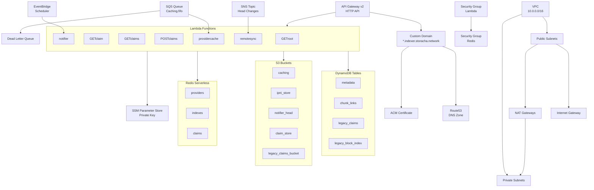

```mermaid
graph TB
%% VPC and Networking
VPC[VPC\n10.0.0.0/16] --> PublicSubnets[Public Subnets]
VPC --> PrivateSubnets[Private Subnets]
PublicSubnets --> IGW[Internet Gateway]
PublicSubnets --> NAT[NAT Gateways]
NAT --> PrivateSubnets

    %% API Gateway
    APIGW[API Gateway v2\nHTTP API] --> Lambda
    APIGW --> CustomDomain[Custom Domain\n*.indexer.storacha.network]
    CustomDomain --> Route53[Route53\nDNS Zone]
    CustomDomain --> ACM[ACM Certificate]

    %% Lambda Functions
    subgraph Lambda[Lambda Functions]
        GETroot
        GETclaim
        GETclaims
        POSTclaims
        notifier
        providercache
        remotesync
    end

    %% Event Sources
    EventBridge[EventBridge\nScheduler] --> notifier
    SNSTopic[SNS Topic\nHead Changes] --> remotesync
    SQSQueue[SQS Queue\nCaching.fifo] --> providercache
    SQSQueue --> SQSDLQueue[Dead Letter Queue]

    %% Storage
    Lambda --> DynamoDB
    subgraph DynamoDB[DynamoDB Tables]
        metadata
        chunk_links
        legacy_claims
        legacy_block_index
    end

    Lambda --> S3
    subgraph S3[S3 Buckets]
        caching
        ipni_store
        notifier_head
        claim_store
        legacy_claims_bucket
    end

    %% Cache
    Lambda --> ElastiCache
    subgraph ElastiCache[Redis Serverless]
        providers
        indexes
        claims
    end

    %% Parameters
    Lambda --> SSM[SSM Parameter Store\nPrivate Key]

    %% Security
    SecurityGroup[Security Group\nLambda] --> CacheSecurityGroup[Security Group\nRedis]
```
